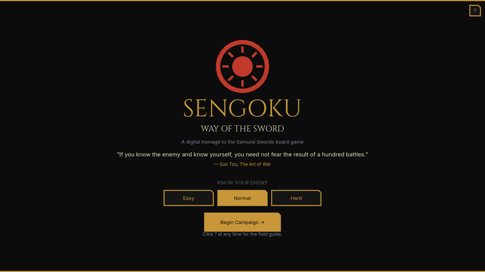
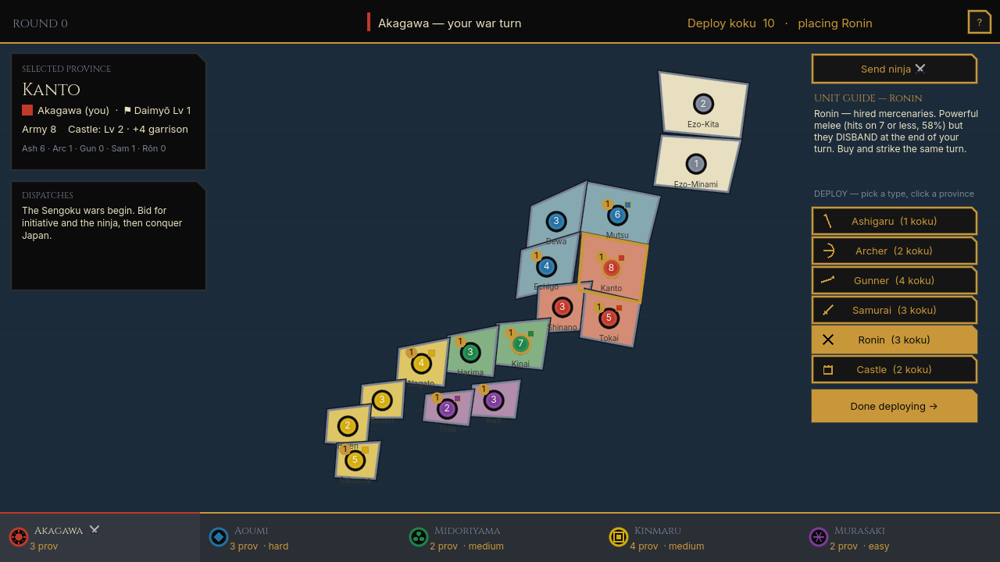

# Sengoku: Way of the Sword ⚔️

A turn-based strategy game of feudal-Japan conquest — a digital homage to the classic
**Samurai Swords / Shogun** board game, themed around Sun Tzu's *The Art of War*.

Bid your koku in secret, raise armies of ashigaru, archers, gunners and samurai, hire
ronin and a shadowy ninja, build castles, lead your daimyō generals into battle, and
unify Japan against three strengths of AI.

> *"If you know the enemy and know yourself, you need not fear the result of a hundred battles."* — Sun Tzu

---

## ▶️ Play it

### Option 1 — Play in your browser (no download)
👉 **https://kc-hansen.github.io/sword/**

### Option 2 — Download for Windows
1. Go to the [**Releases**](https://github.com/kc-hansen/sword/releases/latest) page.
2. Download `Sengoku-Windows.zip`.
3. Unzip it and double-click **`Sengoku.exe`**. That's it — no install needed.

> Windows SmartScreen may warn about an unknown publisher (the build isn't code-signed).
> Click **More info → Run anyway**.

### Option 3 — Run from source (any OS)
1. Install **[Godot 4.6](https://godotengine.org/download)** (the standard build — no C#/.NET needed).
2. Download or clone this repo.
3. Open `project.godot` in Godot and press **▶ Play** (F5).

---

## 🎮 How to play

You are the **red Akagawa clan**. Each round:

1. **Know your enemy** — pick a difficulty on the title screen (Easy / Normal / Hard).
2. **Secret allocation** — split your koku (rice income) behind your shield between a
   **turn-order bid**, a **ninja bid**, and a **levy budget**. *All warfare is based on deception.*
3. **Reveal** — bids flip face-up; turn order is set, and the top ninja bid wins the ninja.
4. **War** — in bid order: optionally send your ninja to assassinate, **deploy** the troops
   you levied (and build castles), then **maneuver** — click one of your provinces (2+ troops),
   then a bordering land to **move** (grey arrow) or **attack** (red ✕).

Hold **10 of 16 provinces**, or eliminate every rival, to be proclaimed Shogun.

Click the **?** button any time for the in-game **Field Guide** explaining every unit,
the castle garrison, combat order, and the ninja.

**Unit cheat-sheet:** Archers & Gunners fire *before* melee (gunners hit hardest), Samurai
are heavy melee, Ashigaru are cheap fodder, Ronin are powerful mercenaries that disband at
end of turn, and Castles add a garrison that absorbs the first blows. Daimyō generals lead
attacks and level up with each victory.

---

## 🛠️ Built with
- **[Godot 4.6](https://godotengine.org)** (GDScript)
- Fonts: **[Cinzel](https://fonts.google.com/specimen/Cinzel)** and **[Inter](https://fonts.google.com/specimen/Inter)** — used under the SIL Open Font License (see `assets/fonts`).
- Quotes from **Sun Tzu's *The Art of War*** (Lionel Giles translation, public domain).

## 📜 License
Game code is released under the **MIT License** (see [LICENSE](LICENSE)). The bundled fonts
remain under their own OFL license.

## ⚠️ Note
This is an original, fan-made strategy game **inspired by** the mechanics of the *Samurai
Swords / Shogun / Ikusa* board game. It is **not affiliated with or endorsed by** Hasbro,
Avalon Hill, or Milton Bradley. All clan names, art, and code here are original.
